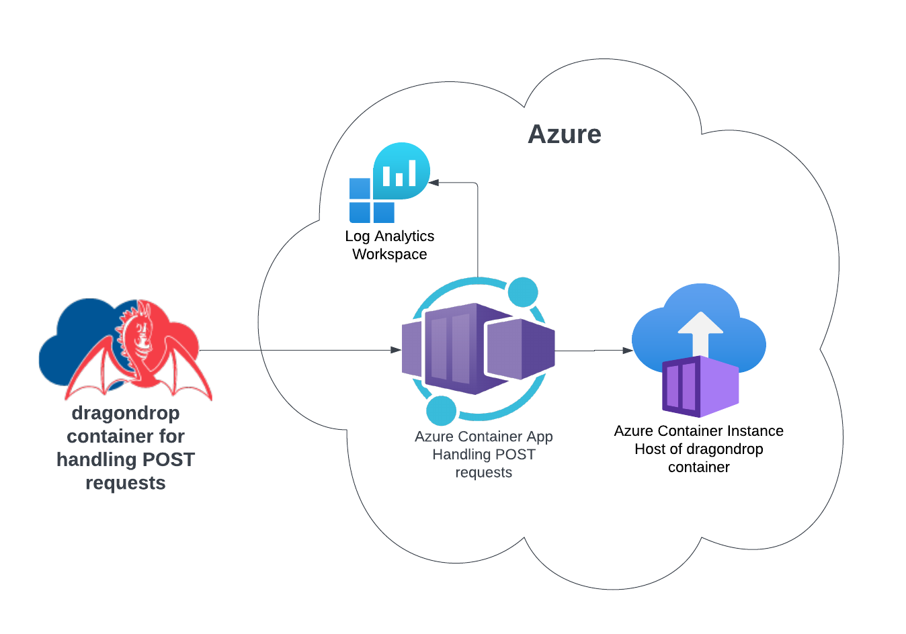

# terraform-azurerm-dragondrop-compute
Module for self-hosting a dragondrop Job within your Azure cloud environment

Available for consumption via HashiCorp's Public Module Registry: https://registry.terraform.io/modules/dragondrop-cloud/dragondrop-compute/azurerm/latest

# dragondrop Self-Hosting Compute
Terraform code for deploying the compute resources needed to run dragondrop.cloud within your Azure environment.

Cloud architecture diagram of the infrastructure created by this module.

## Variables

| Name                      | Type        | Purpose                                                                                         |
|---------------------------|-------------|-------------------------------------------------------------------------------------------------|
| **_location_**            | string      | Azure region into which resources should be deployed.                                           |
| **_resource_group_name_** | string      | Name of the resource group into which the resources from this module are to be deployed.        |
| **_tags_**                | map(string) | An optional mapping of tags to add to resources created by the module.                          |

## Outputs

| Name                                    | Type   | Purpose                                                                                       |
|-----------------------------------------|--------|-----------------------------------------------------------------------------------------------|
| **_container_instance_id_**             | string | ID of the container app instance created by the module.                                       |
| **_https_url_**                         | string | Endpoint of the container app instance to which the dragondrop api should send POST requests. |
| **_log_analytics_container_app_query_** | string | A pre-built log-analytics query to get logs for the provisioned container app instance.       |

## How to Use this Module
This module defines the compute resources needed to run dragondrop within your own Azure cloud environment.

It defines an [Azure Container App](https://github.com/dragondrop-cloud/container-instance-http-trigger) that can
evoke the longer running dragondrop engine living in a provisioned Azure Container Instance.

The url for this Azure Container App is output and should be passed to a dragondrop [Job](https://docs.dragondrop.cloud/product-docs/getting-started/creating-a-job)
definition as that Job's "HTTPS Url". All environment variables that need to be configured are secrets on the Azure Container Instance.

The Azure Container Instance hosts dragondrop's container.

### Security When Using This Module
This module creates a new role, "dragondrop-container-instance-update" which has the minimum permissions needed to evoke
the created Azure Container Instance. This role is given to a new user-assigned identity, "dragondrop-container-app".

## What is dragondrop.cloud?
[dragondrop.cloud](https://dragondrop.cloud) is a provider of IAC automation solutions that are self-hosted
within customer's cloud environment. For more information or to schedule a demo, please visit our website.

## What's a Module?
A Module is a reusable, best-practices definition for the deployment of cloud infrastructure.
A Module is written using Terraform and includes documentation, and examples.
It is maintained both by the open source community and companies that provide commercial support.

## How can I contribute to this module?
If you notice a problem or would like some additional functionality, please open a detailed issue describing
the problem or open a pull request.

### License
Please see [LICENSE](LICENSE) for details on this module's license.

Copyright © 2023 dragondrop.cloud, Inc.
